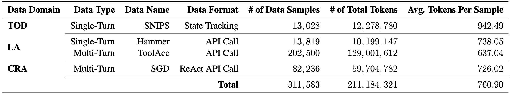
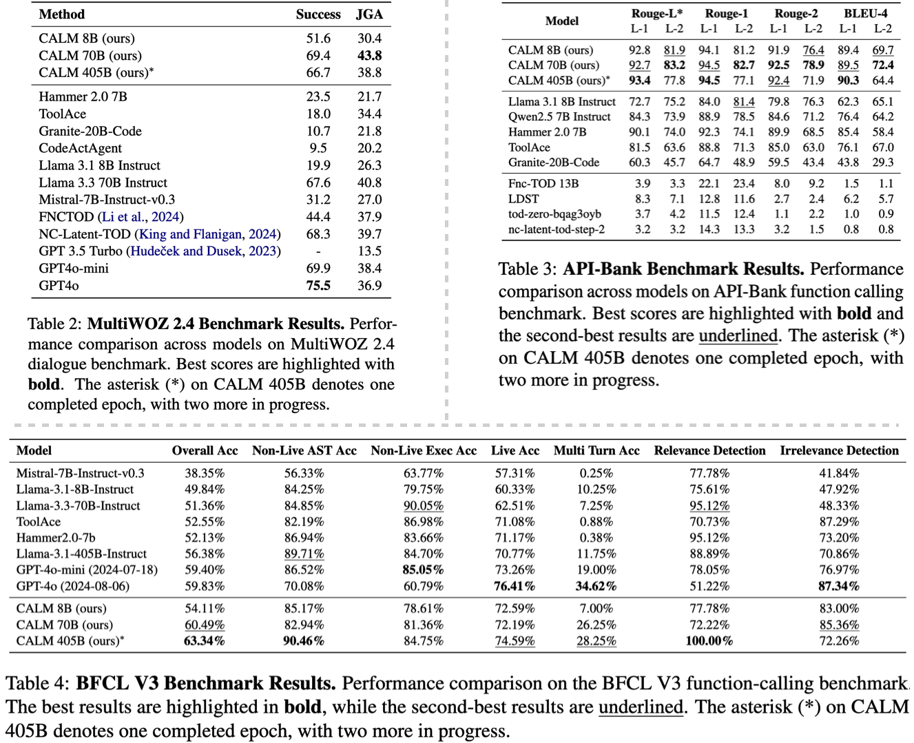

# Can a Single Model Master Both Multi-turn Conversations and Tool Use? CoALM: A Unified Conversational Agentic Language Model

[](https://arxiv.org/abs/2502.08820)
[](https://github.com/oumi-ai/oumi)
[](https://creativecommons.org/licenses/by-nc/4.0/)
[](https://huggingface.co/collections/uiuc-convai/coalm-67a3da0baa69ae101e55699a)
[](https://huggingface.co/datasets/uiuc-convai/CoALM-IT)


**[Can a Single Model Master Both Multi-turn Conversations and Tool Use? CoALM: A Unified Conversational Agentic Language Model](https://emrecanacikgoz.github.io/CoALM/)**
[Emre Can Acikgoz](https://emrecanacikgoz.github.io/), [Jeremiah Greer](https://www.linkedin.com/in/jeremiah-greer-b09294109/), [Akul Datta](https://www.linkedin.com/in/akuldatta), [Ze Yang](https://github.com/zemple), [William Zeng](https://www.linkedin.com/in/williamfzeng), [Oussama Elachqar](https://www.elachqar.com/), [Emmanouil Koukoumidis](http://www.koukoumidis.com/), [Dilek Hakkani-Tür](https://siebelschool.illinois.edu/about/people/faculty/dilek), [Gokhan Tur](https://siebelschool.illinois.edu/about/people/faculty/gokhan)

Large Language Models (LLMs) with API-calling capabilities enabled building effective Language Agents (LA), while also revolutionizing the conventional task-oriented dialogue (TOD) paradigm. However, current approaches face a critical dilemma: TOD systems are often trained on a limited set of target APIs, requiring new data to maintain their quality when interfacing with new services, while LAs are not trained to maintain user intent over multi-turn conversations. Because both robust multi-turn management and advanced function calling are crucial for effective conversational agents, we evaluate these skills on three popular benchmarks: MultiWOZ 2.4 (TOD), BFCL V3 (LA), and API-Bank (LA), and our analyses reveal that specialized approaches excel in one domain but underperform in the other. To bridge this chasm, we introduce **CoALM** (**Co**nversational **A**gentic **L**anguage **M**odel), a unified approach that integrates both conversational and agentic capabilities. We created **CoALM-IT**, a carefully constructed multi-task dataset that interleave multi-turn ReAct reasoning with complex API usage. Using CoALM-IT, we train three models **CoALM 8B**, **CoALM 70B**, and **CoALM 405B**, which outperform top domain-specific models, including GPT-4o, across all three benchmarks.

- Paper: https://arxiv.org/abs/2502.08820
- Project Page: https://emrecanacikgoz.github.io/CoALM/
- Models: [CoALM 8B](https://huggingface.co/uiuc-convai/CoALM-8B), [CoALM 70B](https://huggingface.co/uiuc-convai/CoALM-70B), [CoALM 405B](https://huggingface.co/uiuc-convai/CoALM-405B)
- Dataset: [CoALM-IT](https://huggingface.co/datasets/uiuc-convai/CoALM-IT)

## 🛠 Setup
```bash
git clone https://github.com/oumi-ai/oumi.git
cd oumi/configs/projects/coalm

pip install oumi
```

## ⚙️ Training
Example of Oumi fine-tuning:
```bash
# train CoALM 8B
oumi train -c 8b_train.yaml

# train CoALM 70B
oumi train -c 70b_train.yaml

# train CoALM 405B
oumi train -c 405b_train.yaml
```

## 🚀 Inference
For running inference with CoALM 8B or CoALM 70B:
```bash
# inference with CoALM 8B
oumi infer -i -c 8b_infer.yaml

# inference with CoALM 70B
oumi infer -i -c 70b_infer.yaml
```
🚨 Using CoALM-405B requires 16xH100 NVIDIA GPUs for Inference.

*Oumi multi-node inference support is under development. CoALM-405B likely requires multi-node inference as most single nodes support up to 640GB of GPU VRAM. To run multi-node inference, we recommend [vLLM](https://docs.vllm.ai/en/latest/serving/distributed_serving.html).

## CoALM-IT Dataset


## Results


## ❗️ License
This model is licensed under [Creative Commons NonCommercial (CC BY-NC 4.0)](https://creativecommons.org/licenses/by-nc/4.0/legalcode).

## 📖 Citation
If you use **CoALM-405B** in your research, please cite:
```
@misc{acikgoz2025singlemodelmastermultiturn,
      title={Can a Single Model Master Both Multi-turn Conversations and Tool Use? CoALM: A Unified Conversational Agentic Language Model},
      author={Emre Can Acikgoz and Jeremiah Greer and Akul Datta and Ze Yang and William Zeng and Oussama Elachqar and Emmanouil Koukoumidis and Dilek Hakkani-Tür and Gokhan Tur},
      year={2025},
      eprint={2502.08820},
      archivePrefix={arXiv},
      primaryClass={cs.AI},
      url={https://arxiv.org/abs/2502.08820},
}
```

## 🙏 Acknowledgements
We'd like to thank the [Oumi AI Team](https://github.com/oumi-ai/oumi) for collaborating on training the models, as well as [Together AI](https://www.together.ai/) for providing the compute resources necessary to train CoALM 405B. This project also has benefited from the Microsoft Accelerate Foundation Models Research (AFMR) grant program, through which leading foundation models hosted by Microsoft Azure and access to Azure credits were provided to conduct the research..

---
For more details contact **acikgoz2@illinois.edu**.
